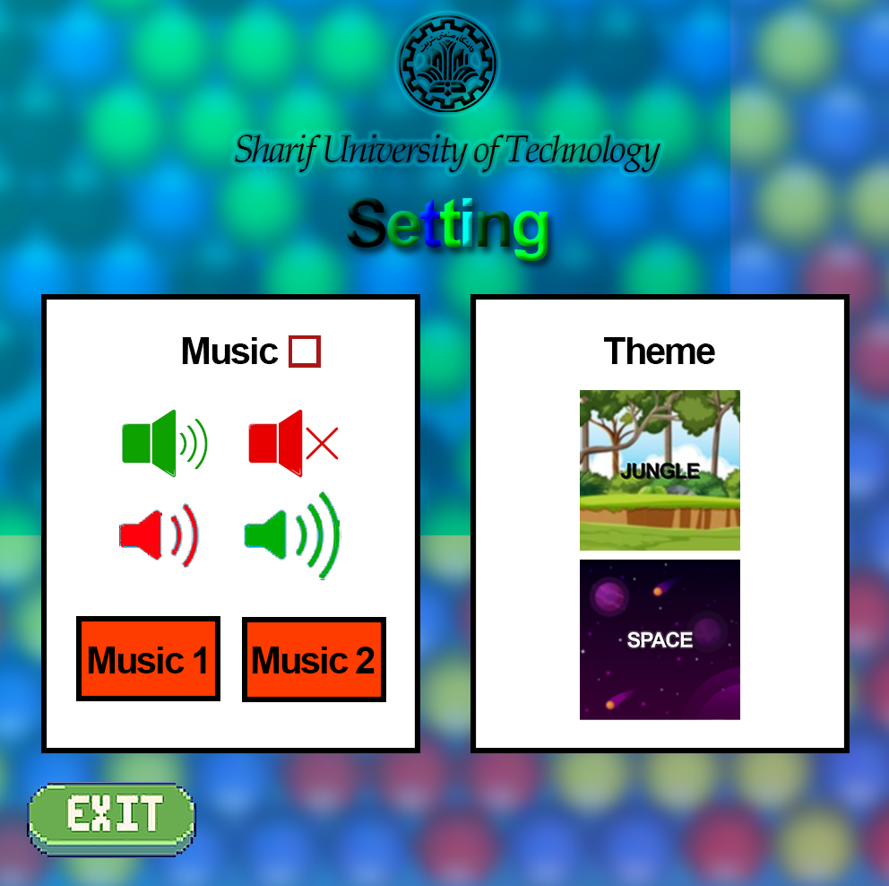
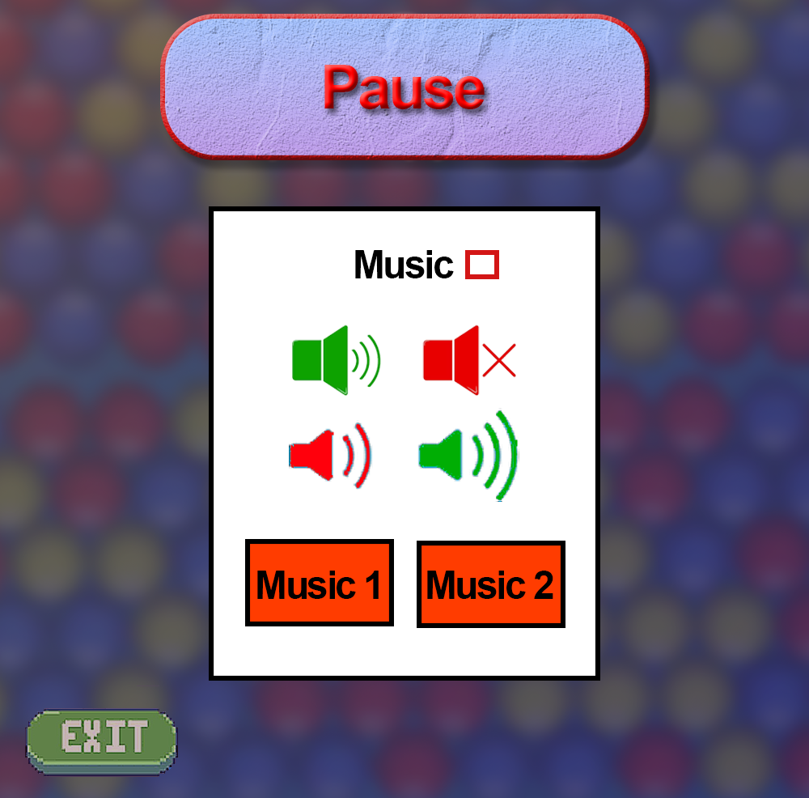
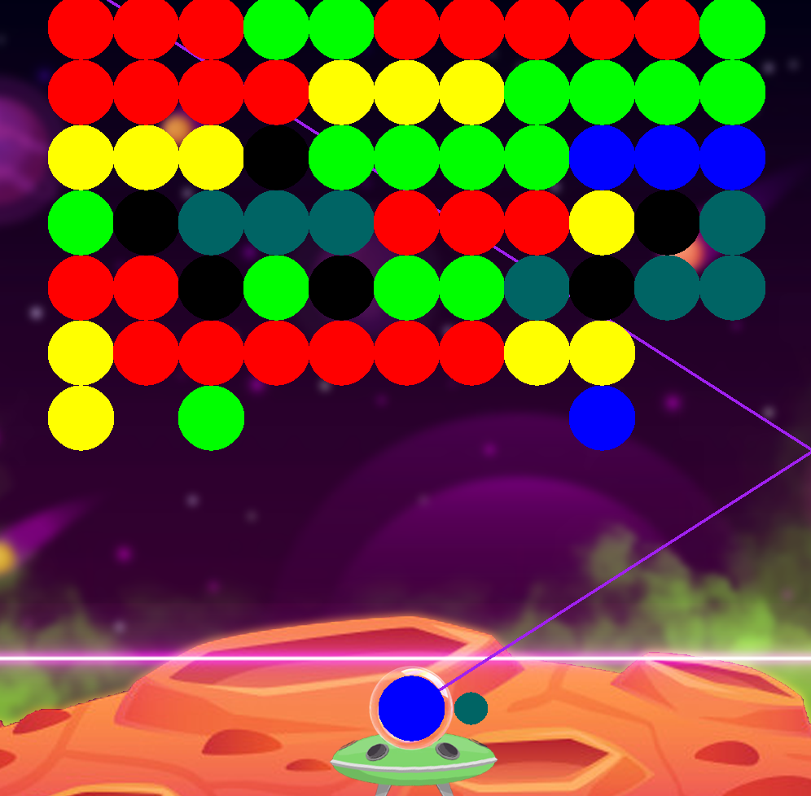

<h1 align = "center"> Bouncing Balls </h1>

>  ***Department of Electrical Engineering, Sharif University of Technology***

<h2 align="left">  TABLE OF CONTENTS </h2>

- [PROJECT DESCRIPTION](#project-description)
    - [DROPING THE UNCONNECTED BALLS](#ghosts-movement)
- [CREDITS](#credits)
- [GAME SNAPSHOTS](#game-snapshots)

<a href="#project-description">
<h2>  Project Description </h2>
</a>

In this project, we are trying to make our own version of the mobile game **Bouncing Balls** using the power of **Procedural Programming** and **C++**.

> This game is **not** developed using the ***Object Oriented*** programming paradigm, eventhough **C++** is capable of it.

As for the graphics, we used **SDL** as a software platform designed to handle Geometric Shapes, Images, Fonts, Audios, etc.

Data is also handled using **Plain Text File**s. There are 2 seperate text files for the setting and the users data to be stored.

> The balls that are not connected to the main network are dropped using a pretty simple ***Path Finding Algorithm***, in fact, all the balls connected to the main network of balls are detected by finding paths of balls from the "walls" to the network, and the remaining balls are dropped.

<a href="#credits">
<h2>  Credits</h2>
</a>

| Name | School | Student ID |
| --- | --- | --- |
| Amirreza Mirjalily | EE Department, SUT | 402102549 |

<a href="#game-snapshots">
<h2>   Game Snapshots</h2>
</a>

